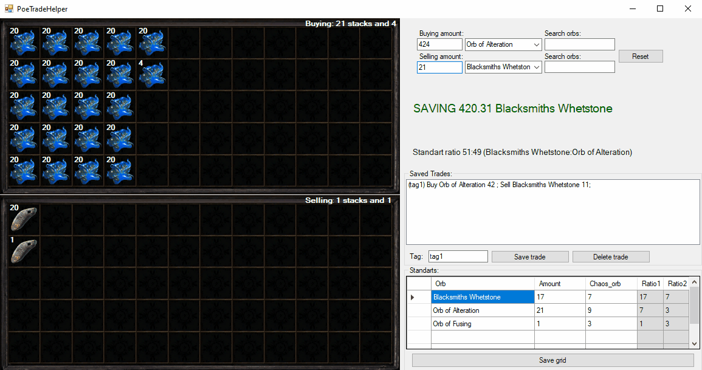

# PoE Trade Helper

A C\# WinForms utility for **Path of Exile** designed to simplify high-volume currency trading. This tool provides real-time ratio calculations and visual inventory previews to ensure players never overpay during complex trades.  

  

## 🚀 Key Features
* **Dynamic Trade Visualization**: Generates a 2D visual representation of your trade window. It automatically calculates and displays full stacks versus remainders, helping users quickly verify the physical count of orbs.  
* **Real-Time Profit/Loss Analysis**: Compares current trade ratios against user-defined "Standard Rates." The app alerts you if you are overpaying, gaining a margin, or hitting a fair market trade.  
* **Currency Search & Management**: Quick-search functionality for all PoE orb types with the ability to save and load frequent trade configurations for faster processing.  
* **Automated Ratio Calculation**: Instantly converts "Buying" and "Selling" amounts into a readable ratio (e.g., 51:49) to match in-game trade site listings.

## ⚙️ How It Works
* **Dynamic UI Generation**: The trade grid is built on-the-fly. The application programmatically generates and layers `PictureBox` and `Label` components over a background canvas to create a "Live Preview" of the trade inventory.  
* **Real-Time Calculation Engine**: As users input values, the app triggers an event-driven calculation loop that updates margins and "Saving/Losing" status labels instantly.  
* **Data Persistence**: Leverages **XML and CSV** for local storage. This allows for persistent user settings, custom standard rates, and a history of saved trades without the overhead of a heavy database.  
* **Asset Management**: Efficiently handles game icons and assets via managed resources, mapped dynamically based on the selected currency type.

## 🏁 Getting Started
1. **Clone the Repository**: Use the GitHub Desktop client or run `git clone https://github.com/seg3214/PoE-Trade-Helper`.  
2. **Prerequisites**: Ensure you have the .NET Framework installed.